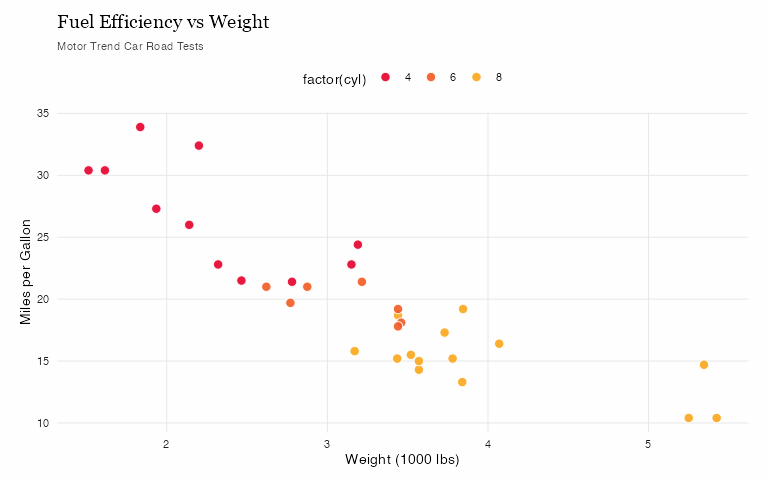
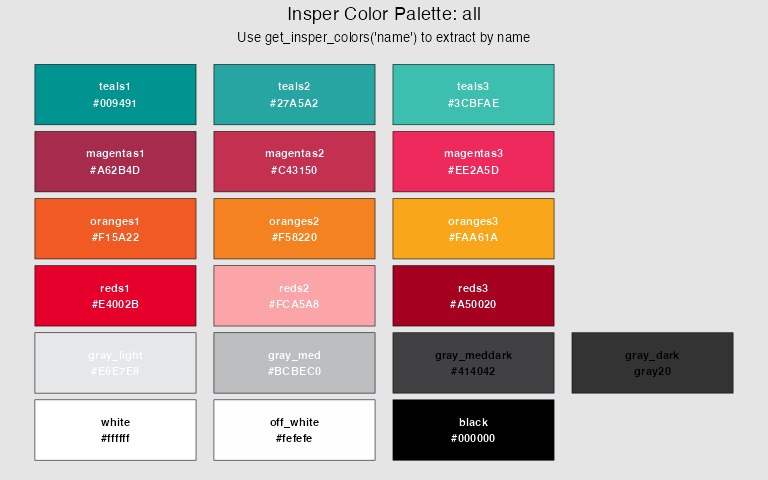

<!-- README.md is generated from README.Rmd. Please edit that file -->

# insperplot 

<!-- badges: start -->

[](https://github.com/viniciusreginatto/insperplot/actions/workflows/R-CMD-check.yaml)
[](https://lifecycle.r-lib.org/articles/stages.html#stable)
<!-- badges: end -->

**insperplot** extends ggplot2 with [Insper Instituto de Ensino e
Pesquisa](https://www.insper.edu.br/) visual identity, providing custom
themes, color palettes, and specialized plotting functions for academic
and institutional use.

## ⚠️ Disclaimer

**This is an unofficial package created by an Insper employee, not an
official Insper product.** This package is developed independently and
is not endorsed, supported, or maintained by Insper Instituto de Ensino
e Pesquisa. For official Insper communications and materials, please
refer to [Insper’s official website](https://www.insper.edu.br/).

## Installation

You can install the development version of insperplot from GitHub:

``` r
# install.packages("remotes")
remotes::install_github("viniciusoike/insperplot")
```

## Setup (Recommended)

For the best results with insperplot, we recommend a one-time setup:

### Quick Setup Wizard

``` r
library(insperplot)
setup_insper_fonts()  # Interactive guide for complete setup
```

### Manual Setup

**Step 1: Install Insper Fonts**

insperplot uses fonts based on Insper’s official template: - **Georgia**
(serif, primary for titles) - typically pre-installed - **Inter**
(sans-serif, for body text) - Google Font - **EB Garamond** & **Playfair
Display** (serif, title fallbacks) - Google Fonts

1.  Visit [Google Fonts](https://fonts.google.com)
2.  Download and install “Inter”, “EB Garamond”, and “Playfair Display”
3.  Restart R/RStudio
4.  Note: Georgia is typically already installed on most systems

**Step 2: Install ragg Graphics Device**

``` r
install.packages("ragg")
```

**Step 3: Configure RStudio (if using RStudio)**

- Go to: **Tools \> Global Options \> General \> Graphics**
- Set **Backend** to **AGG**
- Restart R session

**Note:** If fonts are unavailable, plots automatically fall back to
system defaults (serif/sans).

**Note:** Positron users can skip this step since it uses ragg by
default.

## Quick Start

`insperplot` is built upon Insper’s brand colors. To improve
functionality, additional palettes were created based on these basic
colors.

To use `insperplot` we recommend using `ggplot2`. The basic functions of
the package are `theme_insper()` and the `scale_*_insper_*()` functions.

``` r
library(insperplot)
#> insperplot 1.3.0 loaded.
#> Font setup: ?setup_insper_fonts | Device setup: ?use_ragg_device
library(ggplot2)
library(ragg)

# Create a basic plot with Insper theme
ggplot(mtcars, aes(x = wt, y = mpg, fill = factor(cyl))) +
  geom_point(color = "#ffffff", size = 3, shape = 21, alpha = 0.9) +
  scale_fill_insper_d() +
  theme_insper() +
  labs(
    title = "Fuel Efficiency vs Weight",
    subtitle = "Motor Trend Car Road Tests",
    x = "Weight (1000 lbs)",
    y = "Miles per Gallon"
  )
#> Warning in grid.Call(C_stringMetric, as.graphicsAnnot(x$label)): no font could
#> be found for family "Inter"
#> Warning in grid.Call(C_stringMetric, as.graphicsAnnot(x$label)): no font could
#> be found for family "Inter"
#> Warning in grid.Call(C_stringMetric, as.graphicsAnnot(x$label)): no font could
#> be found for family "Inter"
#> Warning in grid.Call(C_stringMetric, as.graphicsAnnot(x$label)): no font could
#> be found for family "Inter"
#> Warning in grid.Call(C_stringMetric, as.graphicsAnnot(x$label)): no font could
#> be found for family "Inter"
#> Warning in grid.Call(C_stringMetric, as.graphicsAnnot(x$label)): no font could
#> be found for family "Inter"
#> Warning in grid.Call(C_stringMetric, as.graphicsAnnot(x$label)): no font could
#> be found for family "Inter"
#> Warning in grid.Call(C_stringMetric, as.graphicsAnnot(x$label)): no font could
#> be found for family "Inter"
#> Warning in grid.Call(C_stringMetric, as.graphicsAnnot(x$label)): no font could
#> be found for family "Inter"
#> Warning in grid.Call(C_stringMetric, as.graphicsAnnot(x$label)): no font could
#> be found for family "Inter"
#> Warning in grid.Call(C_stringMetric, as.graphicsAnnot(x$label)): no font could
#> be found for family "Inter"
#> Warning in grid.Call(C_stringMetric, as.graphicsAnnot(x$label)): no font could
#> be found for family "Inter"
#> Warning in grid.Call(C_stringMetric, as.graphicsAnnot(x$label)): no font could
#> be found for family "Inter"
#> Warning in grid.Call(C_stringMetric, as.graphicsAnnot(x$label)): no font could
#> be found for family "Inter"
#> Warning in grid.Call(C_textBounds, as.graphicsAnnot(x$label), x$x, x$y, : no
#> font could be found for family "Inter"
#> Warning in grid.Call(C_textBounds, as.graphicsAnnot(x$label), x$x, x$y, :
#> Unable to calculate text width/height (using zero)
#> Warning in grid.Call(C_textBounds, as.graphicsAnnot(x$label), x$x, x$y, : no
#> font could be found for family "Inter"
#> Warning in grid.Call(C_textBounds, as.graphicsAnnot(x$label), x$x, x$y, :
#> Unable to calculate text width/height (using zero)
#> Warning in grid.Call(C_textBounds, as.graphicsAnnot(x$label), x$x, x$y, : no
#> font could be found for family "Inter"
#> Warning in grid.Call(C_textBounds, as.graphicsAnnot(x$label), x$x, x$y, :
#> Unable to calculate text width/height (using zero)
#> Warning in grid.Call(C_textBounds, as.graphicsAnnot(x$label), x$x, x$y, : no
#> font could be found for family "Inter"
#> Warning in grid.Call(C_textBounds, as.graphicsAnnot(x$label), x$x, x$y, :
#> Unable to calculate text width/height (using zero)
#> Warning in grid.Call(C_textBounds, as.graphicsAnnot(x$label), x$x, x$y, : no
#> font could be found for family "Inter"
#> Warning in grid.Call(C_textBounds, as.graphicsAnnot(x$label), x$x, x$y, :
#> Unable to calculate text width/height (using zero)
#> Warning in grid.Call(C_textBounds, as.graphicsAnnot(x$label), x$x, x$y, : no
#> font could be found for family "Inter"
#> Warning in grid.Call(C_textBounds, as.graphicsAnnot(x$label), x$x, x$y, :
#> Unable to calculate text width/height (using zero)
#> Warning in grid.Call(C_textBounds, as.graphicsAnnot(x$label), x$x, x$y, : no
#> font could be found for family "Inter"
#> Warning in grid.Call(C_textBounds, as.graphicsAnnot(x$label), x$x, x$y, :
#> Unable to calculate text width/height (using zero)
#> Warning in grid.Call(C_textBounds, as.graphicsAnnot(x$label), x$x, x$y, : no
#> font could be found for family "Inter"
#> Warning in grid.Call(C_textBounds, as.graphicsAnnot(x$label), x$x, x$y, :
#> Unable to calculate text width/height (using zero)
#> Warning in grid.Call(C_textBounds, as.graphicsAnnot(x$label), x$x, x$y, : no
#> font could be found for family "Inter"
#> Warning in grid.Call(C_textBounds, as.graphicsAnnot(x$label), x$x, x$y, :
#> Unable to calculate text width/height (using zero)
#> Warning in grid.Call(C_textBounds, as.graphicsAnnot(x$label), x$x, x$y, : no
#> font could be found for family "Inter"
#> Warning in grid.Call(C_textBounds, as.graphicsAnnot(x$label), x$x, x$y, :
#> Unable to calculate text width/height (using zero)
#> Warning in grid.Call(C_stringMetric, as.graphicsAnnot(x$label)): no font could
#> be found for family "Inter"
#> Warning in grid.Call(C_stringMetric, as.graphicsAnnot(x$label)): no font could
#> be found for family "Inter"
#> Warning in grid.Call(C_stringMetric, as.graphicsAnnot(x$label)): no font could
#> be found for family "Inter"
#> Warning in grid.Call(C_stringMetric, as.graphicsAnnot(x$label)): no font could
#> be found for family "Inter"
#> Warning in grid.Call(C_stringMetric, as.graphicsAnnot(x$label)): no font could
#> be found for family "Inter"
#> Warning in grid.Call(C_stringMetric, as.graphicsAnnot(x$label)): no font could
#> be found for family "Inter"
#> Warning in grid.Call(C_stringMetric, as.graphicsAnnot(x$label)): no font could
#> be found for family "Inter"
#> Warning in grid.Call(C_stringMetric, as.graphicsAnnot(x$label)): no font could
#> be found for family "Inter"
#> Warning in grid.Call(C_stringMetric, as.graphicsAnnot(x$label)): no font could
#> be found for family "Inter"
#> Warning in grid.Call(C_stringMetric, as.graphicsAnnot(x$label)): no font could
#> be found for family "Inter"
#> Warning in grid.Call(C_stringMetric, as.graphicsAnnot(x$label)): no font could
#> be found for family "Inter"
#> Warning in grid.Call(C_stringMetric, as.graphicsAnnot(x$label)): no font could
#> be found for family "Inter"
#> Warning in grid.Call(C_stringMetric, as.graphicsAnnot(x$label)): no font could
#> be found for family "Inter"
#> Warning in grid.Call(C_stringMetric, as.graphicsAnnot(x$label)): no font could
#> be found for family "Inter"
#> Warning in grid.Call(C_textBounds, as.graphicsAnnot(x$label), x$x, x$y, : no
#> font could be found for family "Inter"
#> Warning in grid.Call(C_textBounds, as.graphicsAnnot(x$label), x$x, x$y, : no
#> font could be found for family "Inter"
#> Warning in grid.Call(C_textBounds, as.graphicsAnnot(x$label), x$x, x$y, :
#> Unable to calculate text width/height (using zero)
#> Warning in grid.Call(C_textBounds, as.graphicsAnnot(x$label), x$x, x$y, : no
#> font could be found for family "Inter"
#> Warning in grid.Call(C_textBounds, as.graphicsAnnot(x$label), x$x, x$y, :
#> Unable to calculate text width/height (using zero)
#> Warning in grid.Call(C_textBounds, as.graphicsAnnot(x$label), x$x, x$y, : no
#> font could be found for family "Inter"
#> Warning in grid.Call(C_textBounds, as.graphicsAnnot(x$label), x$x, x$y, :
#> Unable to calculate text width/height (using zero)
#> Warning in grid.Call(C_textBounds, as.graphicsAnnot(x$label), x$x, x$y, : no
#> font could be found for family "Inter"
#> Warning in grid.Call(C_textBounds, as.graphicsAnnot(x$label), x$x, x$y, :
#> Unable to calculate text width/height (using zero)
#> Warning in grid.Call(C_textBounds, as.graphicsAnnot(x$label), x$x, x$y, : no
#> font could be found for family "Inter"
#> Warning in grid.Call(C_textBounds, as.graphicsAnnot(x$label), x$x, x$y, :
#> Unable to calculate text width/height (using zero)
#> Warning in grid.Call(C_textBounds, as.graphicsAnnot(x$label), x$x, x$y, : no
#> font could be found for family "Inter"
#> Warning in grid.Call(C_textBounds, as.graphicsAnnot(x$label), x$x, x$y, :
#> Unable to calculate text width/height (using zero)
#> Warning in grid.Call(C_textBounds, as.graphicsAnnot(x$label), x$x, x$y, : no
#> font could be found for family "Inter"
#> Warning in grid.Call(C_textBounds, as.graphicsAnnot(x$label), x$x, x$y, : no
#> font could be found for family "Inter"
#> Warning in grid.Call(C_textBounds, as.graphicsAnnot(x$label), x$x, x$y, :
#> Unable to calculate text width/height (using zero)
#> Warning in grid.Call(C_textBounds, as.graphicsAnnot(x$label), x$x, x$y, : no
#> font could be found for family "Inter"
#> Warning in grid.Call(C_textBounds, as.graphicsAnnot(x$label), x$x, x$y, :
#> Unable to calculate text width/height (using zero)
#> Warning in grid.Call(C_textBounds, as.graphicsAnnot(x$label), x$x, x$y, : no
#> font could be found for family "Inter"
#> Warning in grid.Call(C_textBounds, as.graphicsAnnot(x$label), x$x, x$y, : no
#> font could be found for family "Inter"
#> Warning in grid.Call(C_textBounds, as.graphicsAnnot(x$label), x$x, x$y, : no
#> font could be found for family "Inter"
#> Warning in grid.Call(C_textBounds, as.graphicsAnnot(x$label), x$x, x$y, : no
#> font could be found for family "Inter"
#> Warning in grid.Call(C_textBounds, as.graphicsAnnot(x$label), x$x, x$y, : no
#> font could be found for family "Inter"
#> Warning in grid.Call(C_textBounds, as.graphicsAnnot(x$label), x$x, x$y, : no
#> font could be found for family "Inter"
#> Warning in grid.Call.graphics(C_text, as.graphicsAnnot(x$label), x$x, x$y, : no
#> font could be found for family "Inter"
#> Warning in grid.Call.graphics(C_text, as.graphicsAnnot(x$label), x$x, x$y, : no
#> font could be found for family "Inter"
#> Warning in grid.Call.graphics(C_text, as.graphicsAnnot(x$label), x$x, x$y, : no
#> font could be found for family "Inter"
#> Warning in grid.Call.graphics(C_text, as.graphicsAnnot(x$label), x$x, x$y, : no
#> font could be found for family "Inter"
#> Warning in grid.Call.graphics(C_text, as.graphicsAnnot(x$label), x$x, x$y, : no
#> font could be found for family "Inter"
#> Warning in grid.Call.graphics(C_text, as.graphicsAnnot(x$label), x$x, x$y, : no
#> font could be found for family "Inter"
#> Warning in grid.Call.graphics(C_text, as.graphicsAnnot(x$label), x$x, x$y, : no
#> font could be found for family "Inter"
#> Warning in grid.Call.graphics(C_text, as.graphicsAnnot(x$label), x$x, x$y, : no
#> font could be found for family "Inter"
#> Warning in grid.Call.graphics(C_text, as.graphicsAnnot(x$label), x$x, x$y, : no
#> font could be found for family "Inter"
#> Warning in grid.Call.graphics(C_text, as.graphicsAnnot(x$label), x$x, x$y, : no
#> font could be found for family "Inter"
#> Warning in grid.Call.graphics(C_text, as.graphicsAnnot(x$label), x$x, x$y, : no
#> font could be found for family "Inter"
#> Warning in grid.Call.graphics(C_text, as.graphicsAnnot(x$label), x$x, x$y, : no
#> font could be found for family "Inter"
#> Warning in grid.Call.graphics(C_text, as.graphicsAnnot(x$label), x$x, x$y, : no
#> font could be found for family "Inter"
#> Warning in grid.Call.graphics(C_text, as.graphicsAnnot(x$label), x$x, x$y, : no
#> font could be found for family "Inter"
#> Warning in grid.Call.graphics(C_text, as.graphicsAnnot(x$label), x$x, x$y, : no
#> font could be found for family "Inter"
#> Warning in grid.Call.graphics(C_text, as.graphicsAnnot(x$label), x$x, x$y, : no
#> font could be found for family "Inter"
#> Warning in grid.Call.graphics(C_text, as.graphicsAnnot(x$label), x$x, x$y, : no
#> font could be found for family "Inter"
#> Warning in grid.Call.graphics(C_text, as.graphicsAnnot(x$label), x$x, x$y, : no
#> font could be found for family "Inter"
#> Warning in grid.Call.graphics(C_text, as.graphicsAnnot(x$label), x$x, x$y, : no
#> font could be found for family "Inter"
#> Warning in grid.Call.graphics(C_text, as.graphicsAnnot(x$label), x$x, x$y, : no
#> font could be found for family "Inter"
#> Warning in grid.Call.graphics(C_text, as.graphicsAnnot(x$label), x$x, x$y, : no
#> font could be found for family "Inter"
#> Warning in grid.Call.graphics(C_text, as.graphicsAnnot(x$label), x$x, x$y, : no
#> font could be found for family "Inter"
#> Warning in grid.Call.graphics(C_text, as.graphicsAnnot(x$label), x$x, x$y, : no
#> font could be found for family "Inter"
#> Warning in grid.Call.graphics(C_text, as.graphicsAnnot(x$label), x$x, x$y, : no
#> font could be found for family "Inter"
#> Warning in grid.Call.graphics(C_text, as.graphicsAnnot(x$label), x$x, x$y, : no
#> font could be found for family "Inter"
#> Warning in grid.Call.graphics(C_text, as.graphicsAnnot(x$label), x$x, x$y, : no
#> font could be found for family "Inter"
#> Warning in grid.Call.graphics(C_text, as.graphicsAnnot(x$label), x$x, x$y, : no
#> font could be found for family "Inter"
#> Warning in grid.Call.graphics(C_text, as.graphicsAnnot(x$label), x$x, x$y, : no
#> font could be found for family "Inter"
#> Warning in grid.Call.graphics(C_text, as.graphicsAnnot(x$label), x$x, x$y, : no
#> font could be found for family "Inter"
#> Warning in grid.Call.graphics(C_text, as.graphicsAnnot(x$label), x$x, x$y, : no
#> font could be found for family "Inter"
#> Warning in grid.Call.graphics(C_text, as.graphicsAnnot(x$label), x$x, x$y, : no
#> font could be found for family "Inter"
#> Warning in grid.Call.graphics(C_text, as.graphicsAnnot(x$label), x$x, x$y, : no
#> font could be found for family "Inter"
#> Warning in grid.Call.graphics(C_text, as.graphicsAnnot(x$label), x$x, x$y, : no
#> font could be found for family "Inter"
#> Warning in grid.Call.graphics(C_text, as.graphicsAnnot(x$label), x$x, x$y, : no
#> font could be found for family "Inter"
#> Warning in grid.Call.graphics(C_text, as.graphicsAnnot(x$label), x$x, x$y, : no
#> font could be found for family "Inter"
#> Warning in grid.Call.graphics(C_text, as.graphicsAnnot(x$label), x$x, x$y, : no
#> font could be found for family "Inter"
#> Warning in grid.Call.graphics(C_text, as.graphicsAnnot(x$label), x$x, x$y, : no
#> font could be found for family "Inter"
#> Warning in grid.Call.graphics(C_text, as.graphicsAnnot(x$label), x$x, x$y, : no
#> font could be found for family "Inter"
```



``` r
# View available colors
show_insper_colors()
```



## What’s New in v1.3.0: Smart Aesthetic Detection

**insperplot now intelligently detects whether you’re specifying a
static color or mapping a variable!**

``` r
# 🎨 Static colors (quoted strings)
insper_barplot(mtcars, x = factor(cyl), y = mpg, fill = "steelblue")

# 📊 Variable mapping (bare column names)
insper_barplot(mtcars, x = factor(cyl), y = mpg, fill = gear)

# 🌈 Continuous gradients (automatic detection)
insper_scatterplot(mtcars, x = wt, y = mpg, color = hp)
```

**Key benefits:**

- **Intuitive API**: Quoted = color, unquoted = variable
- **Unified parameters**: No more `fill_var` vs `single_color` confusion
- **Automatic scales**: Discrete vs continuous detected automatically
- **Gradient support**: Continuous variables now work everywhere

See `NEWS.md` for migration guide if upgrading from v1.2.0.

## Features

- **Custom Themes**: Professional ggplot2 themes reflecting Insper’s
  visual identity
- **Color Palettes**: Carefully curated color schemes for various data
  visualization needs
- **Specialized Plots**: Pre-configured plotting functions for common
  chart types
- **Brazilian Formatting**: Built-in formatters for Brazilian currency,
  percentages, and numbers
- **Export Utilities**: Helper functions for saving publication-ready
  plots

## Main Functions

- `theme_insper()`: Apply Insper’s visual identity to ggplot2 plots
- `get_insper_colors()`: Extract individual Insper brand colors by name
- `get_palette_colors()`: Extract hex codes from color palettes
- `scale_color_insper_d()` / `scale_fill_insper_d()`: Discrete color
  scales
- `scale_color_insper_c()` / `scale_fill_insper_c()`: Continuous color
  scales
- `show_insper_palette()`: Visualize available color palettes

## Color Palettes

insperplot includes several pre-defined palettes:

- **main**: Primary Insper colors
- **reds**, **oranges**, **teals**, **grays**: Sequential single-color
  gradients
- **diverging**, **red_teal**, **red_teal_ext**: Diverging palettes for
  data with a meaningful center
- **bright**, **contrast**: Qualitative palettes for categorical data
- **categorical**, **accent**: Additional color options

Use `list_palettes()` to see all available palettes with detailed
information.

### Extracting Palette Colors

You can extract hex color codes directly from palettes using
`get_palette_colors()`:

``` r
# Get 5 colors from the reds palette
colors <- get_palette_colors("reds", n = 5)

# Use in custom plots
barplot(1:5, col = colors)

# Use in ggplot2 manual scales
ggplot(iris, aes(Sepal.Length, Sepal.Width, color = Species)) +
  geom_point() +
  scale_color_manual(values = get_palette_colors("main", n = 3))
```

## Documentation

For detailed documentation and examples, visit the [package
website](https://viniciusreginatto.github.io/insperplot/).

## Development

insperplot follows modern R development best practices:

- Native pipe operator (`|>`) throughout
- Modern tidyverse patterns (dplyr 1.1+)
- Comprehensive documentation with roxygen2
- Continuous integration with GitHub Actions

## Contributing

Contributions are welcome! Please see [CONTRIBUTING.md](CONTRIBUTING.md)
for guidelines.

## License

MIT © Vinicius Reginatto

## Acknowledgments

This package was inspired by excellent ggplot2 theme packages including:

- [hrbrthemes](https://github.com/hrbrmstr/hrbrthemes) by Bob Rudis
  (note: removed from CRAN in 2025)
- [bbplot](https://github.com/bbc/bbplot) by BBC Data Team
- [ggthemes](https://github.com/jrnold/ggthemes) by Jeffrey Arnold

**Font Handling Evolution**: This package initially used the showtext
approach for font management. After hrbrthemes was removed from CRAN due
to extrafont dependency issues, we migrated to the modern
`systemfonts + ragg` approach, which eliminates DPI conflicts and
provides better performance.
